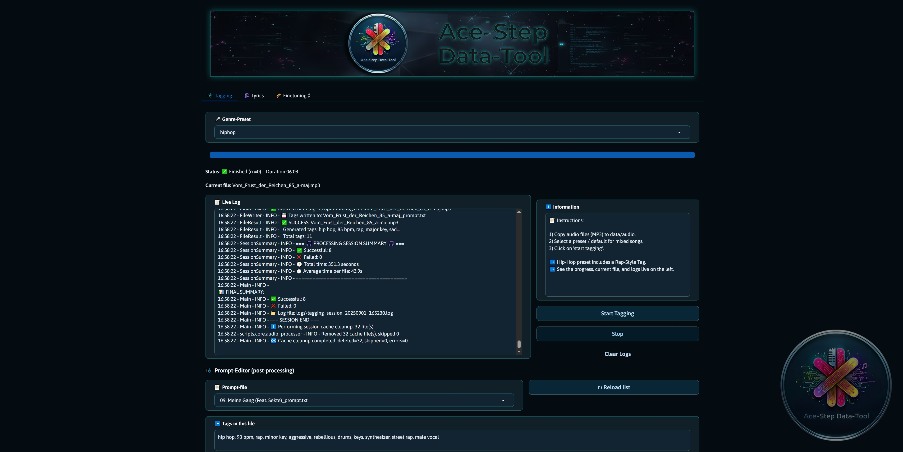

<h1 align="center">🎵 ACE-Step Data-Tool</h1>
<p align="center">
  <strong>Generate clean, structured audio metadata.</strong><br>
  <em>*Extracts lyrics, tags & BPM from audio files – fully automated*</em>
</p>

<p align="center">
  
</p>


## Table of Contents
- [Features](#features)
- [Recommended Setup](#recommended-setup)
- [Windows Installation](#windows-installation)
- [Installation](#installation)
- [Quickstart](#quickstart)
- [Example `_prompt.txt`](#example)
- [Quick Overview](#quick-overview)
- [BPM Detection](#bpm-detection)
- [Lyrics Acquisition](#lyrics-acquisition-lyrics-scraping)
- [Directory Scan & File Processing](#directory-scan--file-processing)
- [Architecture & Flow](#architecture--flow)
- [Finetuning (Ace-StepLoRA Adapter Training)](#finetuning-lora-adapter-training)
- [Important Config Options](#important-config-options)
- [Presets / Whitelist](#presets--whitelist)
- [Troubleshooting](#troubleshooting)
- [Legal / Notes](#legal--notes)
- [License](#license)
- [License & Third-Party Attributions](#license--third-party-attributions)


<a id="features"></a>
### ✨ Features
- 🧠   **LLM-powered Tag Generator** – (genre, moods, bpm, key, instruments, vocals and rap style)
- 🎙️   **Lyric Detection** – automatically via Genius.com
- 🕺   **BPM Analysis** – via Librosa
- 🖥️   **Modern WebUI** – with mood slider, genre presets & custom prompt field
- 🗂️   **Export to ACE-Step training format**
- 🔁   **Retry logic & logging built-in**
- 🧬   **LoRA Finetuning Tab** – end-to-end dataset conversion & LoRA adapter trainingfor the ACE‑Step base model (convert → preprocess → train)

<a id="recommended-setup"></a>
### 💻 Recommended Setup
	| Component  | Recommended   |
	|------------|---------------|
	| OS         | Windows 10 Pro|
	| GPU        | 12 GB VRAM    |
	| RAM        | 32 GB         |
	| Python     | 3.11          |
	| CUDA       | 12.9          |
	| Model      | `Qwen2-Audio-7B-Instruct`|

### Windows Installation
1. *Install NVIDIA Video Driver:*
	- You should install the latest version of your GPUs driver. Download drivers here: [NVIDIA GPU Drive](https://www.nvidia.com/Download/index.aspx).

2. *Install CUDA Toolkit:*
	- Follow the instructions to install [CUDA Toolkit](https://developer.nvidia.com/cuda-toolkit-archive).

3. *Install PyTorch:*
	- Install `torch` and `triton`. 
	- Go to https://pytorch.org to install it. For example `pip install torch torchvision torchaudio triton`
	- You will need the correct version of PyTorch that is compatible with your CUDA drivers, so make sure to select them carefully.
	- [Install PyTorch](https://pytorch.org/get-started/locally/).
	- Confirm if CUDA is installed correctly. Try `nvcc`. If that fails, you need to install `cudatoolkit` or CUDA drivers.

4. *Install BitsandBytes:*
	- Install `bitsandbytes` and check it with `python -m bitsandbytes`
	
### Installation
**Conda Installation** *(recommended)*
```bash
conda create --name acedata python=3.11
conda activate acedata
```

*Install Pytorch*
```bash
pip install torch==2.7.1+cu126 torchvision==0.22.1+cu126 torchaudio==2.7.1+cu126 --index-url https://download.pytorch.org/whl/cu126
```

*Clone the repository*
```bash
git clone https://github.com/methmx83/Ace-Step_Data-Tool.git
cd Ace-Step_Data-Tool
```

*Install dependencies*
```bash
pip install -e .
```

<a id="quickstart"></a>
### 🚀 Quickstart
	
**Launch the WebUI**
```bash
conda activate acedata
acedata
```
**Alternative**
```bash
conda activate acedata
python start.py
```
*Open WebUI* [http://localhost:7860]
  

<a id="example"></a>
## Example: 
*Content of a* **_prompt.txt**
When the pipeline processes an audio file, a `_prompt.txt` is created next to the file. It contains a simple, comma-separated list of tags. Example:
`pop, 114 bpm, electronic, minor, sad, piano, synth pad, female vocal`

## Quick Overview
- Multi-category tagging: 
`genre`, `key` (major/minor), `mood`, `instruments`, `vocal`, and `vocal_fx` (e.g., `autotune`, `harmony`, `pitch-up`).
- Configurable prompts in `config/prompts.json`
- Content-based retry per category (configurable) and audio caching / multi-segment processing.
	
## BPM Detection:
- Function: `detect_tempo(audio_path: str) -> Optional[float]` detects the tempo and returns a number on success.
- Integration: The pipeline calls the detection before prompt/tag generation and adds a normalized tag in the format `XXX bpm` to the generated `_prompt.txt` files.

## Lyrics Acquisition (Lyrics Scraping)
- The lyrics are extracted as plain text (using `Requests` + `BeautifulSoup4`) and saved in a file `<Name>_lyrics.txt`.

## Directory Scan & File Processing
- By default, the tool expects a folder (`data/audio` in the project directory) containing audio files (supported: `.mp3`, `.wav`, `.flac`, `.m4a`).
- All files (recursively in subfolders) are read and processed one after another. Intermediate results and logs are displayed for each track.	

## Architecture & Flow
1. `ContextExtractor` reads Artist/Title from filename.
2. `SegmentPlanner` plans segments according to `workflow_config` and caches the union via `AudioProcessor`.
3. `PromptBuilder` generates system+user prompts per category.
4. `InferenceRunner` calls the model (multiple audio paths per category possible), including technical and content-based retries.
5. `TagPipeline` extracts raw tags per category, normalizes against the whitelist (in `presets/moods.md`), applies Min/Max/Order/Overall limits, and resolves conflicts.
6. Orchestrator writes final tags as `*_prompt.txt` next to the audio file.

<a id="finetuning-lora-adapter-training"></a>
## 🧬 Finetuning (Ace-Step LoRA Adapter Training)
The WebUI tab **"🧬 Finetuning"** lets you train a LoRA adapter for the ACE‑Step base model. The process is strictly sequential (no parallel runs):

### Workflow (UI)
1. **Convert Dataset**  
   Converts audio files + corresponding `_prompt.txt` (and optional `_lyrics.txt`) into JSON samples.  
   Script: `scripts/train/convert2hf_dataset_new.py`  
   Defaults:  
   - `--data_dir` → `data/audio`  
   - `--output_name` → `data/data_sets/jsons_sets`

2. **Create Dataset**  
   Builds feature / token dataset for efficient training (embeddings, tokens, caches).  
   Script: `scripts/train/preprocess_dataset_new.py`  
   Defaults:  
   - `--input_name` → `data/data_sets/jsons_sets`  
   - `--output_dir` → `data/data_sets/train_set`

3. **Start Finetuning**  
   Launches LoRA training (only adapter weights; base model layers stay frozen depending on the LoRA config).  
   Typical parameters (internally applied / UI-controlled):  
   - `--dataset_path data/data_sets/train_set`  
   - `--lora_config_path config/lora/<file>.json`  
   - `--exp_name <adapter-name>` (folder & run id)  
   - `--save_every_n_train_steps <N>`  
   - `--save_last <K>` (rolling retention of last snapshots)  
   - Optional resume: `--last_lora_path <path>/pytorch_lora_weights.safetensors`

### Optional UI Fields
Can be overridden in the tab (otherwise defaults are used):
- `data_dir`
- `output_name`
- `input_name`
- `output_dir`

### Quickstart (CLI)
```bash
# 1) Convert to JSON samples
python scripts/train/convert2hf_dataset_new.py ^
  --data_dir data/audio ^
  --output_name data/data_sets/jsons_sets

# 2) Build feature / training dataset
python scripts/train/preprocess_dataset_new.py ^
  --input_name data/data_sets/jsons_sets ^
  --output_dir data/data_sets/train_set

# 3) LoRA training (example)
python scripts/train/trainer_optimized.py ^
  --dataset_path data/data_sets/train_set ^
  --lora_config_path config/lora/Ace-LoRa.json ^
  --exp_name LoRa_r256_8bit ^
  --optimizer adamw8bit ^
  --batch_size 1 ^
  --accumulate_grad_batches 2 ^
  --max_steps 1000 ^
  --save_every_n_train_steps 100 ^
  --save_last 5 ^
  --precision bf16
```

### Resume a Run
1. Locate the latest snapshot in `data/lora/<exp_name>/epoch=...-step=..._lora/`  
2. Restart with `--last_lora_path <full path>/pytorch_lora_weights.safetensors` (same `--exp_name`).

### Memory & Performance (12 GB VRAM)
- `batch_size=1` + `--accumulate_grad_batches=2` to reduce peak VRAM.
- `adamw8bit` (bitsandbytes) lowers optimizer memory.
- High LoRA ranks (`r > 256`) can easily exceed memory – test cautiously.
- Optionally offload text encoder to CPU (slower, more system RAM usage).
- Use `--precision bf16` (fallback FP16) for stable mixed precision.

### Outputs / Artifacts
LoRA weights: `data/lora/<exp_name>/epoch=E-step=S_lora/pytorch_lora_weights.safetensors`

Optional analysis helpers (if present):
- `scripts/train/helpers/inspect_lora_adapter.py`
- `scripts/train/helpers/verify_lora.py`
- `scripts/train/helpers/analyze_lora.py`

### Common Issues
| Problem | Cause | Fix |
|---------|-------|-----|
| Training does not start | Skipped Convert/Create steps | Run steps 1 & 2 first |
| Loss = NaN | Learning rate too high / corrupt sample | Lower LR, inspect data |
| Resume not loading | Path or exp_name mismatch | Align path & exp_name |
| CUDA OOM | Rank too high or too many target modules | Lower rank / restrict target modules |
| Missing `_prompt.txt` | Tagging not executed | Run Tagging tab first |

---

## Important Config Options
- `config/prompts.json` — Prompt templates and `workflow_config.default_categories` (standard now includes `key` and `vocal_fx`).
- `workflow_config.audio_segments` — e.g., `["best","middle"]` (are cached).
- `output_format.min_tags_per_category` / `max_tags_per_category` — Min/Max per category.

## Presets / Whitelist
- `presets/moods.md` contains the allowed tags for `genres`, `moods`, `instruments`, `vocal types`, `keys`, and `vocal_fx`.
- New: `presets/hiphop/moods.md` is an example preset for Hip-Hop-specific tags. Select it in the UI or via `--moods_file presets/hiphop/moods.md` in the CLI run.

## Troubleshooting
- Missing tags: Check logs (console + log file). The parser attempts several fallbacks: JSON objects, arrays, code blocks, quoted JSON, and heuristic text search.

## Legal / Notes
- Web scraping of sites like Genius may be subject to restrictions by their Terms of Service. Please check the legal situation before running automated scrapes on a large scale.


### License
Apache-2.0 license

## License & Third-Party Attributions
This repository and the included code are distributed under the Apache License, Version 2.0. The full license text is included in the `LICENSE` file at the repository root.

Third-party components included in this project are documented in `third_party/THIRD_PARTY_LICENSES.md` and `NOTICE`. Several files and modules were derived from or inspired by other projects that are themselves licensed under Apache-2.0. Those original copyright notices and license headers are retained in the copied files where present.
- [ACE-Step] (https://github.com/ace-step/ACE-Step)
- [woctordho] (https://github.com/woct0rdho/ACE-Step)
